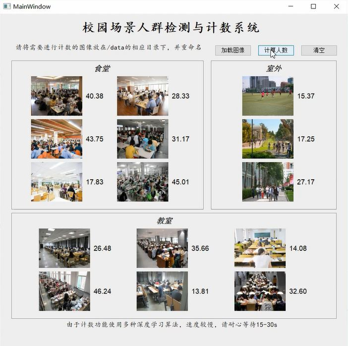

# Crowd Counting GUI System

This is a crowd counting GUI system developed by pyqt4 which combines 3 models including YOLO, RetinaNet and MCNN.

### Quick Start
+ Download the models from [BaiduYun](https://pan.baidu.com/s/1e4N4A8ZD65YG307OT44jdA) with code _7tfh_
and save them to directory **final_models/**
+ Put the testing images in **data/**
+ run **main.py**

### Demo
